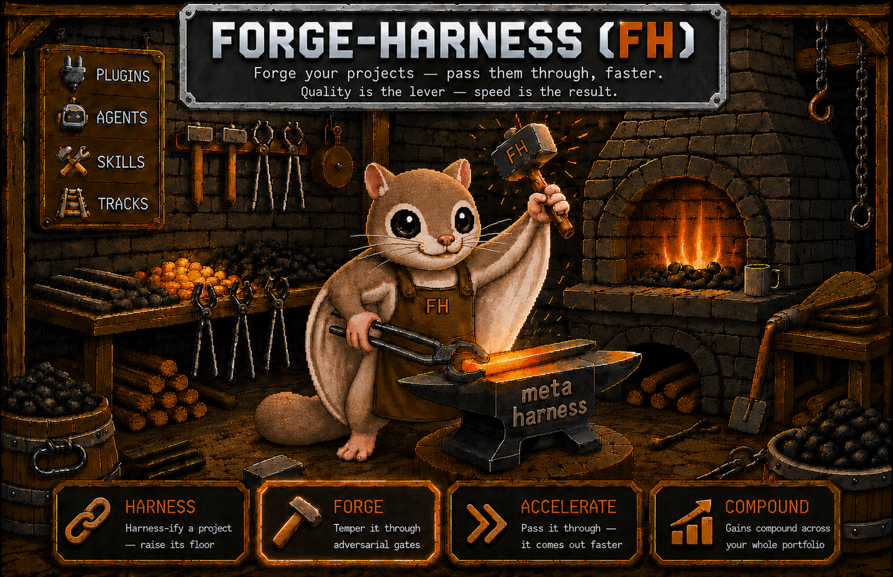

<p align="center">
  
</p>

<p align="center">
  <a href="LICENSE"></a>
  
  <a href="https://zenodo.org/records/20397566"></a>
  
  
</p>

<p align="center">
  <b>Fork it. Rename it. Make it yours.</b><br>
  A persistent knowledge hub that connects all your Claude Code projects — shared skills, accumulated context, and a compounding improvement loop.
</p>

---

| If you're here because… | forge-harness solves it |
|---|---|
| Context disappears when a session ends | Persistent `tracks/` — resumable from anywhere |
| You repeat the same setup for every project | Connect once to the hub, share across all projects |
| Your team's AI know-how lives only in people's heads | Codify it so everyone shares it |
| You want AI to get *better* as work accumulates | Skills and patterns compound session over session |
| You're evaluating AI-generated code with no governance layer | `fh-gate` wraps any coding agent as a post-generation gate |

> **Worried about token costs?** New install footprint ≈ 14.5% of 200K context. `context-doctor` diagnoses and reduces this further. → [Token optimization](#token-cost-optimization)

| Where you are now | Jump to |
|---|---|
| Starting from scratch | [Get started in 2 minutes](#get-started-in-2-minutes) |
| Already using it, want more | [33 asset activation check](#already-using-it----33-asset-activation-check) |
| Wrapping an external coding agent | [Governance layer](#governance-layer-for-ai-generated-code) |
| Want to spread it to your team | [Operating model Phase 3](#operating-model----3-phase-essence) |

---

> **This document is for humans.** AI operating rules → `CLAUDE.md` · Command reference → `CHEATSHEET.md`

---

## What is this?

An **acceleration hub** for teams already using Claude Code. Connect N projects to one hub — work, learnings, and patterns from each project **mutually reinforce** each other. Build skills and agents once in the hub; share them across every project.

> **Goal**: Get into orbit in the age of AI acceleration without burning out. Minimize setup friction, optimize context, distribute expertise by task complexity, and raise the success rate of every session.

forge-harness is structured as two distinct layers:

| Layer | Contents | AI compatibility |
|---|---|---|
| **Methodology layer** (model-agnostic) | `tracks/`, `knowledge/`, `SKILL.md` documents, session protocols | Any AI model |
| **Automation layer** (Claude-native) | `.claude/agents/`, hooks, slash commands, `CLAUDE.md` rules | Claude Code only |

The **methodology layer** is the portable core — connecting projects to a persistent hub, accumulating learnings in `tracks/`, curating cross-project knowledge in `knowledge/shared/`. Works regardless of which AI you use.

The **automation layer** is what makes the methodology frictionless when running Claude Code: agents dispatch automatically, hooks fire at session boundaries, and slash commands invoke skills without manual prompting.

> **Codex-compatible beta**: Gemini, Codex, and other AI users can apply the methodology layer manually. Automation layer features require Claude Code as host.

---

## Finding your entry path

Teams using AI collaboration tools systematically are already doing **harness engineering**: QA protocols, verification pipelines, structures that make AI behave more consistently. forge-harness is the **OS one layer above** — a system that measures, improves, and evolves the harness itself across multiple projects.

| Layer | What it does | Examples |
|---|---|---|
| Harness engineering | Per-project rules, gates, context management | QA protocols, CLAUDE.md rulesets, TC verification pipelines |
| **Meta harness engineering** | Cross-project system to measure, improve, evolve harnesses | FH skill bus, harness-doctor, steel-quench, field-harvest |

> **FH v1.0 paper** — published 2026-05-30 on [Zenodo](https://zenodo.org/records/20397566) (DOI: 10.5281/zenodo.20397566) · arXiv submission in review. Documents the 2-layer design, 6-axis framework, 4-agent orchestration, and compounding loop with controlled empirical evidence.

> **External validation (2026)** — three independent research findings converge:
> - VILA-Lab analysis of Claude Code v2.1.88 (512K lines): [98.4% is harness infrastructure, 1.6% AI logic](https://arxiv.org/abs/2604.14228)
> - "[Code as Agent Harness](https://arxiv.org/abs/2605.18747)" (arXiv, May 2026, 43 authors)
> - Stanford IRIS Lab: "[Meta-Harness](https://arxiv.org/abs/2603.28052)" (Lee et al., Mar 2026) — outer-loop harness optimization; +7.7pts at 4× fewer tokens

#### FH vs. automated harness tools

The Stanford paper inspired [harness-evolver](https://github.com/raphaelchristi/harness-evolver) — a fully automated 7-stage CODE optimizer. FH independently converged on the same loop architecture from the opposite direction:

| Axis | harness-evolver | forge-harness |
|---|---|---|
| **Optimization target** | Harness code (prompts, routing) | Harness knowledge (context, patterns, expertise) |
| **Evolution** | Auto-merge winners to git | Human-approved at every stage |
| **Infrastructure** | LangSmith + Python 3.10+ | CLAUDE.md + skills only, zero extra |
| **Scope** | Single-harness optimization | Multi-project federation, shared skill bus |
| **Knowledge layer** | No persistent curation | `tracks/` + `knowledge/` grow over time |

They're complementary — FH's approval gates and knowledge layer fill exactly the gaps automated CODE search leaves open.

Count how many apply to you:

- [ ] You have 2 or more Claude Code projects
- [ ] You lose context when a session ends
- [ ] You repeat the same patterns and rules across multiple projects
- [ ] You want to spread AI methodology to your team
- [ ] You want AI to improve as work accumulates

| Count | Recommended path |
|:---:|---|
| **3+** | Standard entry → [Get started in 2 minutes](#get-started-in-2-minutes) |
| **1–2** | Plugin first → `claude plugin install -s user fh-meta@forge-harness` |
| **0** | Single-project stage — check back when you reach 2+ projects. `context-doctor` is available standalone now |

---

## Get started in 2 minutes

> **Prerequisite**: Claude Code CLI installed. Verify: `claude --version`

### Step 0. Register the plugin

```bash
claude plugin marketplace add https://github.com/chrono-meta/forge-harness.git
claude plugin install -s user fh-meta@forge-harness
```

> If Step 0 fails: run `claude plugin update fh-meta@forge-harness`, or check that your network can reach `github.com`.

Verify: type `/skills` in the CC chat → if `install-wizard` appears, you're done.

### Step 1. Clone the hub

```bash
git clone https://github.com/chrono-meta/forge-harness.git ~/forge-harness
cd ~/forge-harness
```

> **Standard path**: Fork on GitHub first → clone your fork → accumulate `tracks/` and `knowledge/` there → periodically pull upstream updates from forge-harness. Rename it to make it yours.

### Step 2. Say something

```bash
claude
```

> ✅ **Expected**: Claude reads `CLAUDE.md`, asks what project to connect or what task to start.
>
> ❌ **Generic response?** → Run `pwd` to confirm you're in the `forge-harness` root. If not: `cd ~/forge-harness && claude`

From here:
- **"Connect a project"** → hub scans `../`, lists projects with `.git`, creates `tracks/{project}/` on confirmation
- **"My projects are in `~/work/`"** → specify a different root

---

## Governance layer for AI-generated code

FH wraps any coding agent (OpenCode, Codex, etc.) as a **post-generation governance layer** — no runtime adapter needed. FH reads files the agent writes; the protocol is the interface.

```bash
# After a coding agent completes a task:
./scripts/fh-gate.sh                   # auto-detects changed files from git diff
# → steel-quench adversarial pass      # behavioral edges, untested contracts, security
# → pipeline-conductor --quick         # 4-axis: regression / adversarial / grounding / record
# → FH_GATE_VERDICT                    # PASS | PENDING | BLOCKED | ESCALATE
```

**Empirical result (2026-05-31)**: Applied to OpenCode's own AI-generated `permission/arity.ts` (163 lines, 6 tests passing, CI green). Governance verdict: PENDING — 2 A-grade findings CI didn't cover (short-token overflow in allowlist, executor tools absent from arity table). Delta attributable to methodology layer, not the model.

Full spec: `knowledge/shared/harness-core/fh_integration_contract.md` · Usage: `knowledge/shared/harness-core/fh_opencode_governance_wrapper.md`

> **One-line install (coming soon)**: `npx @forge-harness/fh-gate "src/foo.ts" quick ci` — npm publish in progress.

---

## Real-world case — AI TC generation prompt hardening

> **Context**: An AI-powered test case generation tool was merging TC outputs without quality validation. Prompts contained cushion language, phantom claims, and no priority guardrails.

**Applied**: `steel-quench` (W1–W8 adversarial hardening) + `source-grounding-audit` (phantom claim detection)

| Wave | What was attacked | Result |
|---|---|---|
| W1–W2 | Cushion language ("it would be good to…") → forced conditions | Ambiguity eliminated |
| W4–W5 | No self-check step → Self-Check quality gate added | Quality bypass path closed |
| W6 | Soft review → Hard gate ("no next step until fix complete") | Incomplete TC merge blocked |
| W7 | P0 ratio inflation → forced re-review above 30% | Priority inflation prevented |
| W8 | Phantom Claim Guard — unspecified values/button names banned | Fabricated expected results blocked |

**Outcome**: 4 bugs found and fixed · 8-layer quality gate complete · output noise eliminated

> The self-healing loop: steel-quench attacks the prompt → execution catches bugs the review missed → fixes are verified in the same pass.

---

## Already using it — 33 asset activation check

<details>
<summary>Expand full asset table (33 skills + 5 agents)</summary>

Check which of the following are **regularly activating** for you:

| Asset | Role | Natural language triggers | Active |
|---|---|---|:---:|
| `agent-composer` | Plans optimal agent dispatch | "How should I split this across agents?", "Run in parallel" | □ |
| `apex-review` | Final quality review from executive perspective | "Will this hold up with decision-makers?" | □ |
| `verify-bidirectional` | Reverse-verify decisions | "Is that right?", "Double-check this" | □ |
| `deliberation` *(fh-commons)* | Structured multi-angle argument | "Battle it out", "Review this from multiple angles" | □ |
| `cross-ecosystem-synergy-detection` | Detect cross-tool synergies | "Are my installed tools working together?" | □ |
| `plugin-recommender` | Plugin recommendations | "Is there a good tool for this?" | □ |
| `hub-cc-pr-reviewer` | Automated PR review | "Review this PR", "Is it okay to merge?" | □ |
| `context-doctor` | Token efficiency + `.claudeignore` | "Session is slow", "Clean up context" | □ |
| `sim-conductor` | Meta-simulation orchestrator | "External user perspective", "Internal audit" | □ |
| `steel-quench` | Full-spectrum adversarial verification — attacks output patterns (self-declarations, cushion language, structural flaws) | "Run the quench", "Attack from the root" | □ |
| `source-grounding-audit` | Source back-tracing — detects Phantom Claims (no source found). Attacks input tracing (where did this come from?) | "Verify the source", "Grounding audit" | □ |
| `harness-doctor` | Harness structure diagnosis | "Something seems wrong with my Claude setup" | □ |
| `deep-clarify` | Socratic requirements clarification | "I'm not sure what I need to build", "Clarify this" | □ |
| `meta-prompt-builder` | Meta prompt design | "Write a prompt for each Wave", "What should I tell the agent?" | □ |
| `install-doctor` | Diagnose conflicts before/after plugin install | "Is it okay to add this plugin?" | □ |
| `install-wizard` | Initial environment diagnosis + onboarding | "First-time setup", "Just installed this" | □ |
| `asset-placement-gate` | New asset belongs in FH or project? | "Should this be shared?", "Hub vs project" | □ |
| `marketplace-gate` | 5-point fitness gate before listing | "Is it okay to list this?" | □ |
| `field-harvest` | Back-propagate field patterns to hub | "I could reuse this in other projects" | □ |
| `hub-persona-auditor` | Pre-publish 4-axis audit | "How will this look to others?" | □ |
| `fact-checker` | Asset deduplication check | "Isn't there something similar already?" | □ |
| `persona-innovator` | Naming gap detection + ideation | "What would be a good name for this?" | □ |
| `contention-layer` | Treat skill conflicts as harvest signals | "These two skills conflict" | □ |
| `context-bridge-dispatch` | Inject session context cards before parallel dispatch | "Brief the agents first", "Parallel dispatch" | □ |
| `frontier-digest` | Frontier signals (HN, arXiv) → actionable insights | "AI trend digest", "What's new this week" | □ |
| `harvest-loop` | End-of-session learning → evolution pipeline | "Harvest the session", "Run the pipeline" | □ |
| `self-marketing-lint` | Remove self-marketing language from skill descriptions | "Description diet", "Strip the marketing tone" | □ |
| `pipeline-conductor` | 4-axis quality gate (backward/adversarial/forward/record) | "Run the quality gate", "4-axis check" | □ |
| `goal-quench` | `/goal` wrapper with token budget gate + pipeline-conductor verification | "Safe goal run", "Goal with budget control" | □ |
| `edit-manifest` | Predict-verify loop for harness edits | "Log this edit", "Predict what this changes" | □ |
| `memory-hygiene` | Detect stale memory entries + re-verify live | "Check stale memory", "Memory drift" | □ |
| `prompt-regression` | Detect behavioral regressions after rule edits | "Did my rule change break anything?" | □ |
| `convergence-loop` *(fh-commons)* | N-round convergence loops — only "truly passed" after convergence | "Suspicious of single-pass", "Convergence loop" | □ |
| `token-budget-gate` *(fh-commons)* | Pre-task token cost estimate (GREEN/YELLOW/ORANGE/RED) | "How expensive is this?", "Token budget estimate" | □ |
| `mcp-circuit-breaker` *(fh-commons)* | Detects MCP tool failure patterns, blocks further calls | "MCP keeps failing", "Tool error loop" | □ |
| `quench-challenger` *(fh-commons)* | Pressure-tests near-final artifacts from adversarial angles | "Challenge this with a devil", "Quench challenger" | □ |

| Count | Diagnosis |
|:---:|---|
| **28–36** | Advanced — focus on `agent-composer` + `sim-conductor` + `steel-quench` + `pipeline-conductor` chained |
| **10–27** | Activation stage — gradually activate unchecked assets |
| **0–9** | Early stage — go back to self-diagnosis above |

</details>

---

## How it works

```
forge-harness (the brain — persistent hub)
├── knowledge/   →  referenced from all projects
└── tracks/      →  work records per project

Project A (the execution site)
  → connect hub in CLAUDE.md → auto-referenced

Project B (the execution site)
  → connect hub in CLAUDE.md → auto-referenced
```

- **From the hub**: invoke Claude Code → cross-project judgment with integrated context
- **From each project**: project-specific work + hub reference
- **"Hello"** → Claude automatically pulls recent context and today's tasks from the hub *(when running `claude` from the FH cwd)*

```
Search:  CATALOG.md (tags + summary) → open that file directly
Store:   End of session → save to tracks/{project}/ → update CATALOG.md
Return:  New pattern found → save to tracks/{project}/learnings/
Share:   Common to 2+ projects → write to knowledge/shared/
```

---

## Core usage

| What you want | What to say |
|---|---|
| Start a session | "Hello" → reads hub, guides today's tasks |
| Save session | "Sync this session to forge-harness" |
| Search past work | "What did I do around April 13th?" |
| Connect a new project | "Connect a project" |
| Run adversarial review | "Run the quench on this" |
| Run end-of-session harvest | "Harvest the session" |

---

## Agent dispatch

forge-harness includes specialized agents and `agent-composer` to plan their optimal combination.

```
/agent-composer
```

Analyzes the current task and proposes which agents to dispatch in what order.

### FH agents

| Agent | Role | Tool restrictions |
|---|---|---|
| `plan` | Read-only design agent — analyzes files, maps impact, plans before implementation | Read·Bash·Glob·Grep only |
| `fact-checker` | Asset deduplication and staleness check | Read·Grep·Glob |
| `hub-persona-auditor` | 3+ persona audit of externally published assets | Read·Grep·Glob |
| `persona-innovator` | Naming exploration + frame proposals | Read·Grep·Glob·WebSearch·WebFetch |
| `quench-challenger` | Steel-quench adversary — pressure-tests near-final artifacts | Read·Grep·Glob |

### Parallel dispatch

Request two agents in a single message to run in parallel:

```
"Run fact-checker and persona-innovator in parallel.
  First: check [asset path] for duplicates
  Second: scan current harness for naming gaps"
```

> **Validated**: 6 background agents dispatched in parallel from meta-harness cwd → completed in ~3 minutes (~5× faster than sequential).

---

## Multi-Model Sidecar (v1.3)

Each available AI CLI (Gemini, Codex, `gh copilot`) forms an independent review team alongside Claude. Cross-team synthesis surfaces Claude blind spots — issues external teams catch that single-model review misses. The sidecars act as **peer reviewers**, not primary orchestrators; skill invocation and harness automation remain Claude Code-native.

**Coverage tiers (measured on `source-grounding-audit/SKILL.md`):**
| Tier | Setup | Defects found |
|---|---|---|
| **C1** Single Claude persona | Default | 25% |
| **C2** 3 cross-session Claude personas | No extra tools | 75% |
| **C3** C2 + external CLI (Gemini/Codex/gh copilot) | External CLI installed | 100% — +3 Claude blind spots |

Claude-side token cost: **zero increase** C2→C3. External CLI billed to its own quota.

Decision rule: routine → C2, pre-publish → C3+.

> **Corporate path**: `gh copilot` as sidecar (GitHub Copilot CLI, separate enterprise license). Requires headless operability — use `gh copilot -- -p "..." --allow-all-tools`. Note: CLI presence ≠ headless capable; verify with `--allow-all-tools` before adding to CI.

---

## Runtime requirements

| Environment | Support | Notes |
|---|---|---|
| Claude Code + Anthropic API Key | ✅ Recommended | 200K context · officially supported |
| claude.ai Pro / Team Plan | ✅ Recommended | 200K context · officially supported |
| AWS Bedrock (direct API) | ⚠️ Conditional | Possible with sufficient account quota |
| Bedrock + LiteLLM proxy | ⚠️ Unofficial | Frequent `Input is too long` errors |
| Internal AI API proxy | ⚠️ Conditional | Depends on `max_input_tokens` config |

---

## Plugin install

```bash
claude plugin marketplace add https://github.com/chrono-meta/forge-harness.git
claude plugin install -s user fh-meta@forge-harness
```

Verify: `/skills` or `/agents` in Claude Code chat. Updates aren't automatic — run `claude plugin update fh-meta@forge-harness` periodically.

#### Plugin catalog

| Plugin | Skills | Agents |
|---|---|---|
| **fh-meta** (v1.3) | 29 skills — agent-composer · apex-review · asset-placement-gate · contention-layer · context-bridge-dispatch · context-doctor · cross-ecosystem-synergy-detection · deep-clarify · edit-manifest · field-harvest · frontier-digest · goal-quench · harness-doctor · harvest-loop · hub-cc-pr-reviewer · install-doctor · install-wizard · marketplace-gate · memory-hygiene · meta-prompt-builder · pipeline-conductor · plugin-recommender · prompt-regression · self-marketing-lint · sim-conductor · source-grounding-audit · steel-quench · verify-bidirectional · and more | 3 (hub-persona-auditor · fact-checker · persona-innovator) |
| **fh-commons** (v0.2.0) | 4 skills — convergence-loop · deliberation · mcp-circuit-breaker · token-budget-gate | 1 (quench-challenger) |

#### Mode C (plugin only — no clone)

```bash
claude plugin marketplace add https://github.com/chrono-meta/forge-harness.git
claude plugin install fh-meta@forge-harness
cd ~/projects/{your-project} && claude
```

| Skill / area | Mode A (clone + plugin) | Mode C (plugin only) |
|---|:---:|:---:|
| `verify-bidirectional` · `apex-review` | ✅ hub baseline | ⚠️ no `knowledge/` |
| `cross-ecosystem-synergy-detection` · `plugin-recommender` | ✅ hub cross-ref | ⚠️ your project only |
| Meta/hub seed accumulation | ✅ `knowledge/shared/` | ❌ |

#### Mode D — agent file copy only

The lightest entry. Copy a single agent file to use immediately:

```bash
mkdir -p <your-project>/.claude/agents/
cp <harness-root>/.claude/agents/fact-checker.md <your-project>/.claude/agents/
```

#### Connecting FH context to existing project CC

```bash
cp {FH_ROOT}/templates/local_fh_context.md .claude/rules/local_fh_context.md
echo ".claude/rules/local_fh_context.md" >> .git/info/exclude
```

After this, `claude` in that project recognizes FH skills, session locations, and how to reference them. Token footprint: ~200 tokens (pointer file only).

---

## Token cost optimization

**Native overhead** — measured: new install standalone ≈ 29K tokens (14.5% of 200K). Top 2 heaviest files: `.claude/rules/*.md` (~20K) and `CLAUDE.md` (~8.7K). `context-doctor` diagnoses and recommends keyword-trigger deferral for infrequently-used rules (saves 5–8K).

**1. `.claudeignore` standard** — copy `templates/.claudeignore` to your project root. Defaults: `node_modules/` · `dist/` · `.next/` · `*.lock` · `*.min.js` · `.env`

**2. Model switching** — `/model sonnet` (coding) · `/model opus` (reasoning) · `/model opusplan` (hybrid)

**3. Agent view parallel execution** — `context-bridge-dispatch` auto-injects session context cards. 2+ independent tasks → parallel by default; 5–6× acceleration.

**4. Automated audits** — terminal-start zshrc hook:

```bash
export FH_DIR="$HOME/path/to/forge-harness"
source "$FH_DIR/templates/fh_audit_check.zsh"
```

---

## Operating model — 3 Phase essence

### Phase 1 — Initial setup (active onboarding)

Greeting from the FH cwd → AI proactively proposes → asks about task → runs 5 skills → setup → hands off to project cwd.

### Phase 2 — Backstage optimization

User works from the **field project cwd**. The hub is not directly invoked but performs lateral optimization: `.claudeignore` applied, model switching active, fh-meta skills naturally activate from description triggers.

### Phase 3 — Threshold return (autonomous proposals)

When work matures and new skills or upgrades are possible, this AI **proactively proposes** returning to meta-harness from the field cwd.

| Trigger | Signal |
|---|---|
| New generalizable pattern emerges | First discovery of a pattern worth promoting |
| 3+ accumulated upgrades | Stabilization signal from the same asset evolving |
| Sister asset absorption | External PR audit gate passed |

### Command tower pattern (advanced)

| Task type | Recommended location |
|---|---|
| Single project coding/debugging | That project's cwd |
| Meta/audit/simulation | **Meta-harness cwd + Agent** |
| 2+ projects simultaneously | **Meta-harness cwd + parallel Agent** |
| field-harvest · PR audit · CATALOG updates | **Meta-harness cwd + Agent** |

---

## Steel-quench convergence — multi-layer defense

| Layer | Mechanism |
|:---:|---|
| **L1** | harness-doctor + context-doctor + sim-conductor Area B — isolated third-person evaluation |
| **L2** | Real user feedback + external PR review — evidence generated outside owner environment |
| **L3** | steel-quench pre-runs attack angles internally; flaws patched before external devils run |
| **L4** | Meta-aware adversary — remaining attack surface shrinks per wave |

---

## Research & external validation

> **FH v1.0 paper** — published 2026-05-30 on [Zenodo](https://zenodo.org/records/20397566) (DOI: 10.5281/zenodo.20397566) · arXiv submission in review. Documents the 2-layer design, 6-axis framework, 4-agent orchestration, and compounding loop with controlled empirical evidence.

Three independent research findings converge on the same layer:
- VILA-Lab analysis of Claude Code v2.1.88 (512K lines): [98.4% is harness infrastructure, 1.6% AI logic](https://arxiv.org/abs/2604.14228)
- "[Code as Agent Harness](https://arxiv.org/abs/2605.18747)" (arXiv, May 2026, 43 authors)
- Stanford IRIS Lab: "[Meta-Harness](https://arxiv.org/abs/2603.28052)" (Lee et al., Mar 2026) — outer-loop harness optimization; +7.7pts at 4× fewer tokens

The Stanford paper also inspired [harness-evolver](https://github.com/raphaelchristi/harness-evolver) (fully automated CODE optimizer). FH converged on the same loop architecture from the opposite direction — complementary, not competing. See `knowledge/shared/harness-core/fh_ecosystem_positioning.md`.

---

## Learn more

- `CLAUDE.md` — Sync/Push protocol · AI operating rules
- `AGENTS.md` — Runtime agent specs
- `CATALOG.md` — Search index
- `CHEATSHEET.md` — Full command reference
- `CONTRIBUTING.md` — How to contribute skills and patterns
- `knowledge/shared/harness-core/fh_integration_contract.md` — Governance layer spec

---

## Appendix

### Directory structure

```
forge-harness/
├── knowledge/             # Pure knowledge — time-independent, for reference
│   ├── domain/            # Domain-specific knowledge
│   └── shared/            # Cross-project patterns
│
├── tracks/                # Work records per project — time-accumulated
│   └── {project_name}/
│       ├── session_*.md   # Session history
│       └── learnings/     # Accumulated feedback
│
├── plugins/               # fh-meta + fh-commons plugins
├── templates/             # Skeletons to copy for new projects
├── scripts/               # fh-gate.sh and automation scripts
├── docs/                  # Diagrams and reference assets
├── CATALOG.md             # Full search index
├── CLAUDE.md              # AI operating rules + Sync/Push protocol
└── CHEATSHEET.md          # Command cheat sheet
```

### Key terms

| Term | Definition |
|---|---|
| **Meta-harness** | A persistent hub connecting work, learnings, and patterns of N Claude Code projects for mutual reinforcement |
| **Launch pad effect** | Meta-harness as launch pad, not destination — passing through accelerates the starting line |
| **Shared skill pool** | Common skill/agent pool eliminating reinvention cost across teams and projects |
| **Environment engineering** | Not making the agent smarter, but making the environment easier for the agent to work in |
| **Harness engineering** | Per-project structures (rules, gates, context management) that make AI behave more consistently |
| **Meta harness engineering** | Cross-project system to measure, improve, and evolve harnesses — FH's core layer |
